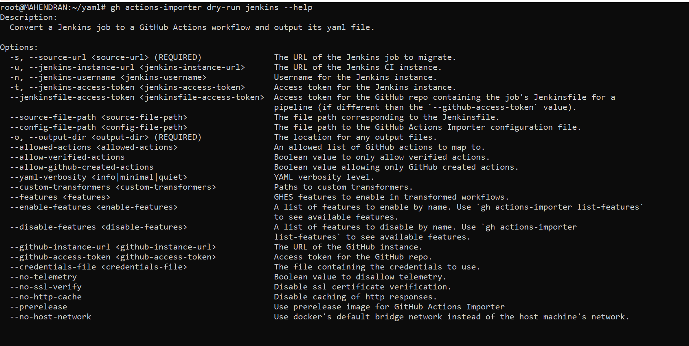
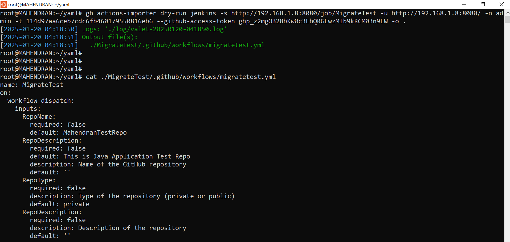
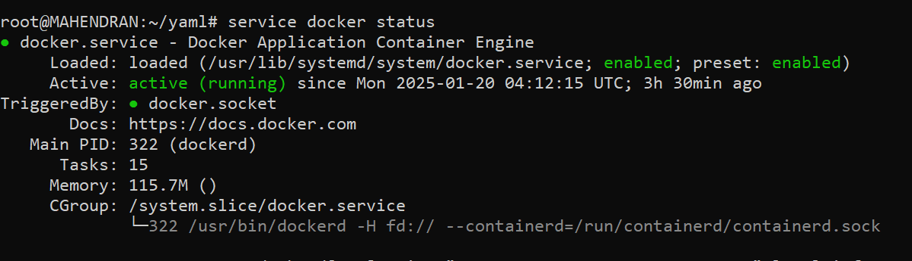

#### Install GitHub CLI in Ubuntu
Run below command to install GitHub CLI
```
(type -p wget >/dev/null || (sudo apt update && sudo apt-get install wget -y)) && sudo mkdir -p -m 755 /etc/apt/keyrings         && out=$(mktemp) && wget -nv -O$out https://cli.github.com/packages/githubcli-archive-keyring.gpg         && cat $out | sudo tee /etc/apt/keyrings/githubcli-archive-keyring.gpg > /dev/null && sudo chmod go+r /etc/apt/keyrings/githubcli-archive-keyring.gpg && echo "deb [arch=$(dpkg --print-architecture) signed-by=/etc/apt/keyrings/githubcli-archive-keyring.gpg] https://cli.github.com/packages stable main" | sudo tee /etc/apt/sources.list.d/github-cli.list > /dev/null && sudo apt update && sudo apt install gh -y
```

#### Import GitHub Actions Importer in GitHub CLI
First, Set the GitHub Credentials either environment variable or use "gh auth login" command to login interactively
```
export GH_TOKEN=""
```
Run extension install command to import gh-actions-importer
```
 gh extension install github/gh-actions-importer
```

#### Make Sure docker should be installed and Daemon is up and running


#### Run GitHub Actions Importer command to migrate pipelines from Jenkins to GitHub Actions.
Before run the importer command, Update the github actions importer
```
gh actions-importer update
```
Run the Github Actions importer command
```
gh actions-importer dry-run jenkins -s <Migrate Job Url> -u <Jenkins Url> -n <UserName> -t <Jenkins Token> --github-access-token <gh token> -o <dir>
```

###### Sample Output



###### Possible Options



